# SLA Dashboard

The SLA Dashboard is a Django web application that in conjunction with the 
[Atos SLA Manager Core](https://github.com/Atos-FiwareOps/sla-framework)
and the Monitoring and Authentication Generic Enablers from
[FiWare](http://fiware.org/) provides a user interface to manage SLA components
and their lifecycle.

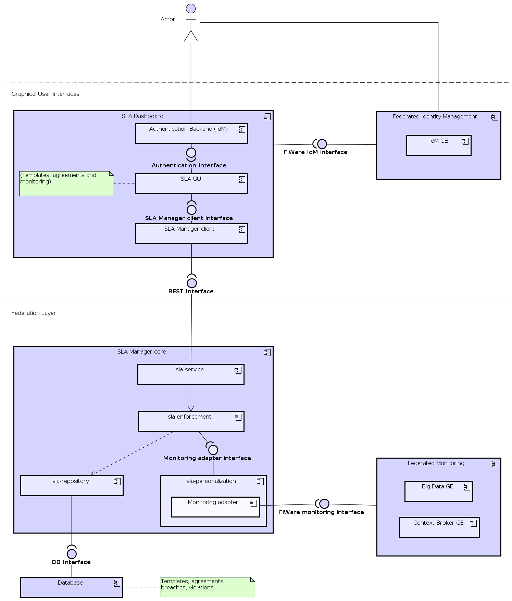

The SLA Dashboard allows to:

* Create SLA templates for exiting services in Fiware.
* Create SLA Agreements from defined templates.
* Check information about an existing SLA template.
* Check information about an existing SLA agreement.
* Visualize information about violations and breaches.

All these operations rely tightly on the user credentials and permissions inside
the Fiware's project. This information is retrieved from the Fiware's
identity manager.

# User guide

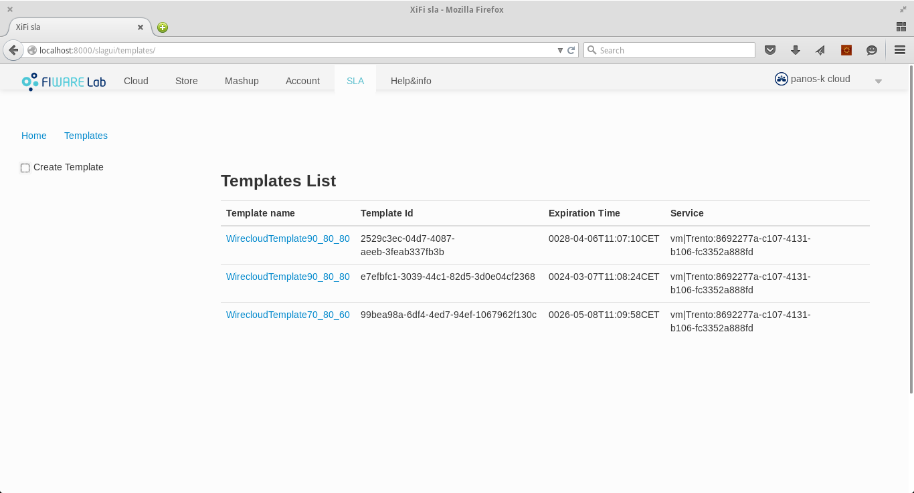
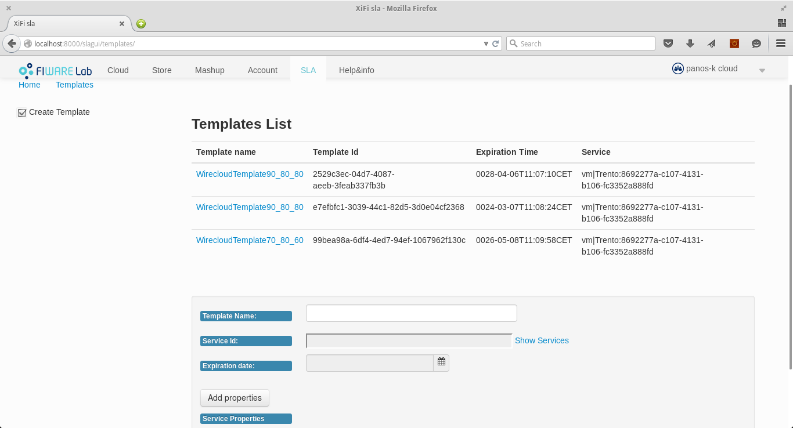
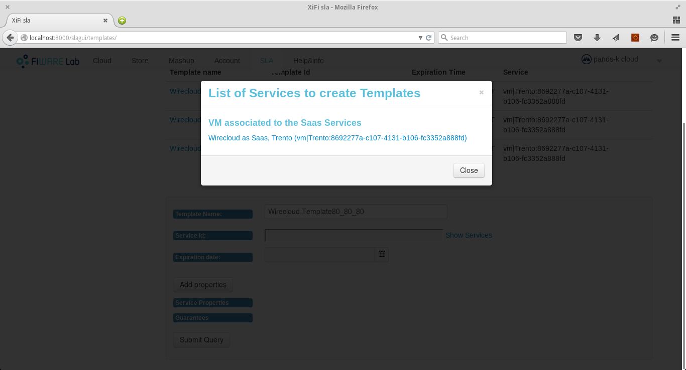
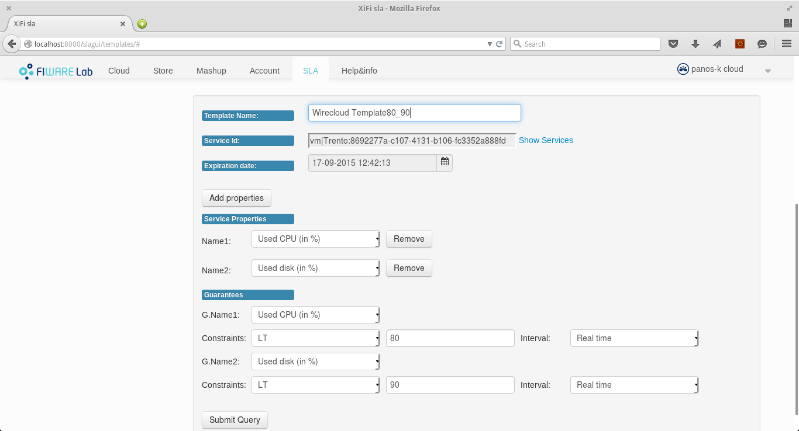
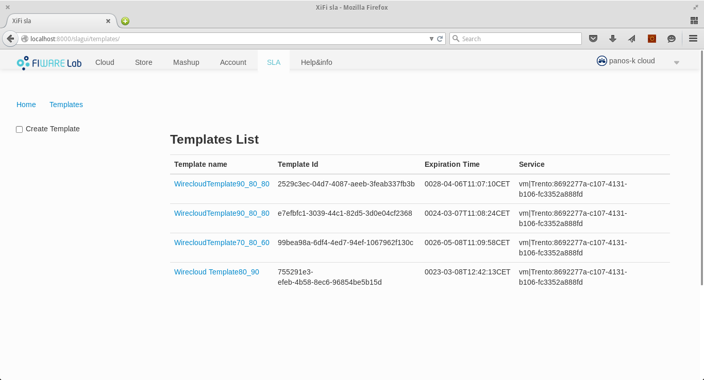
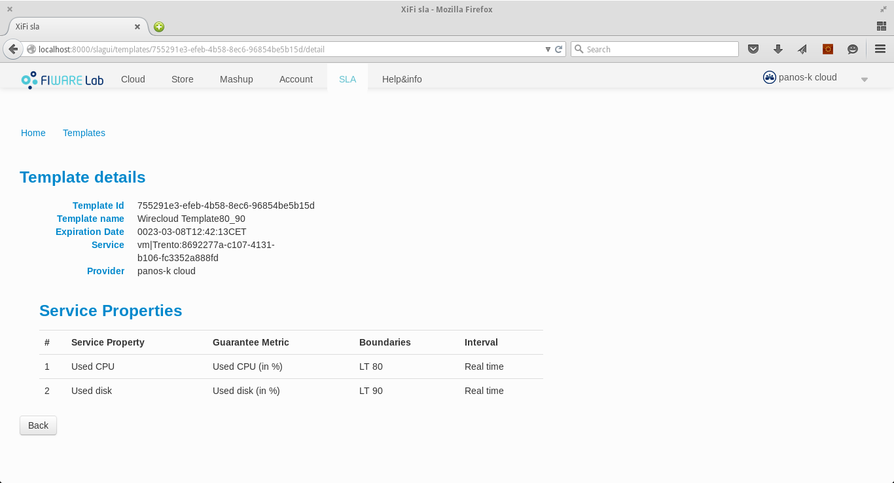
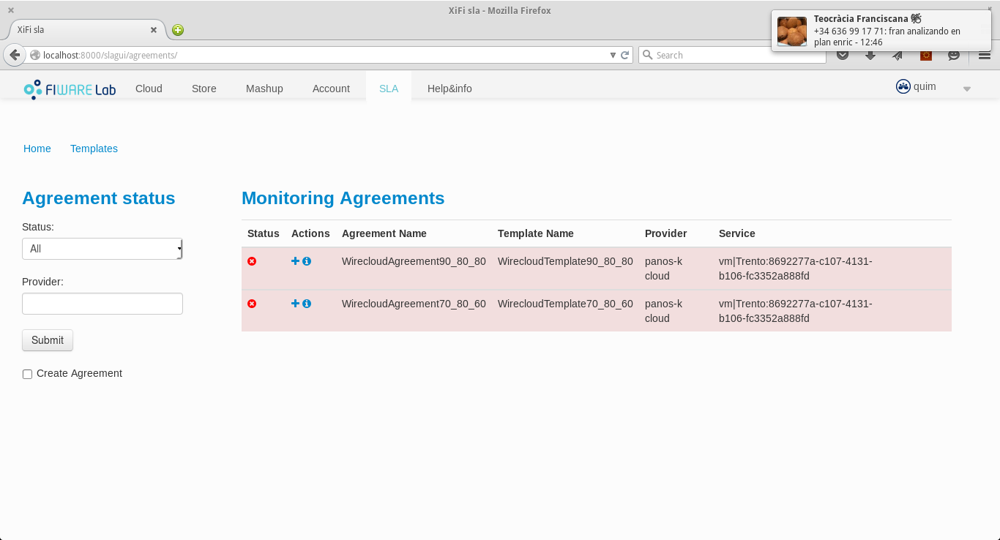
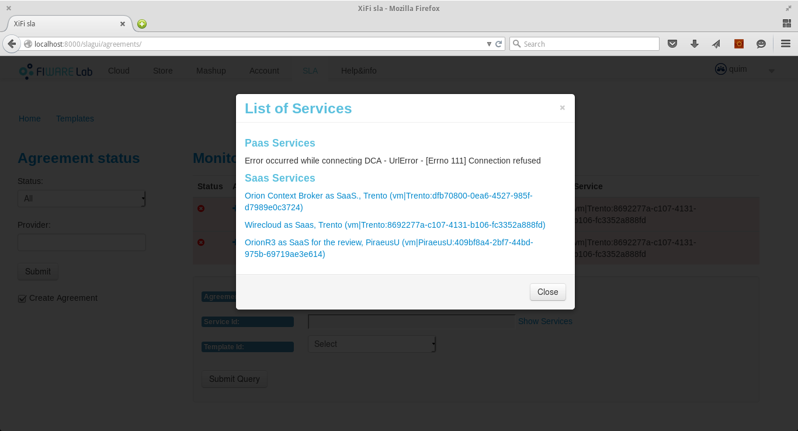
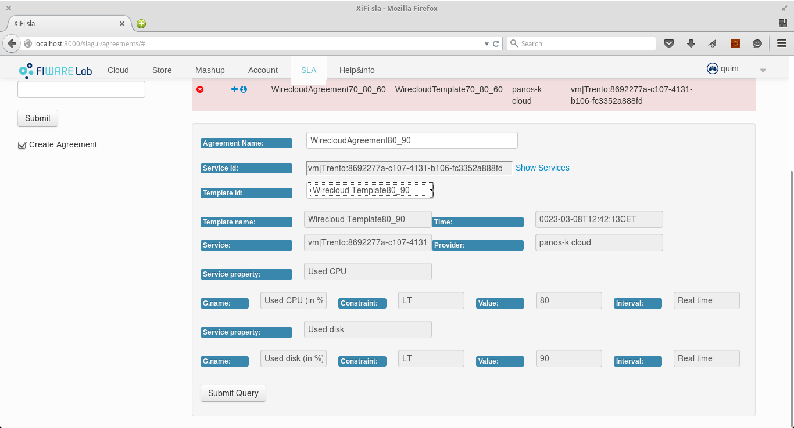
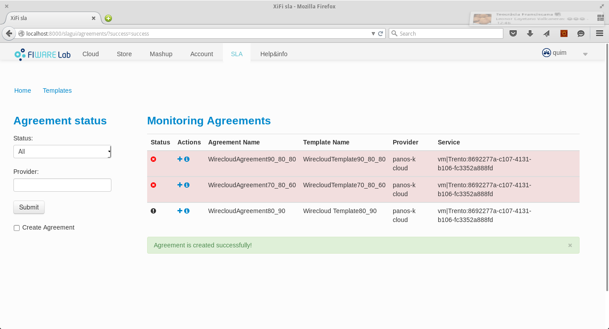
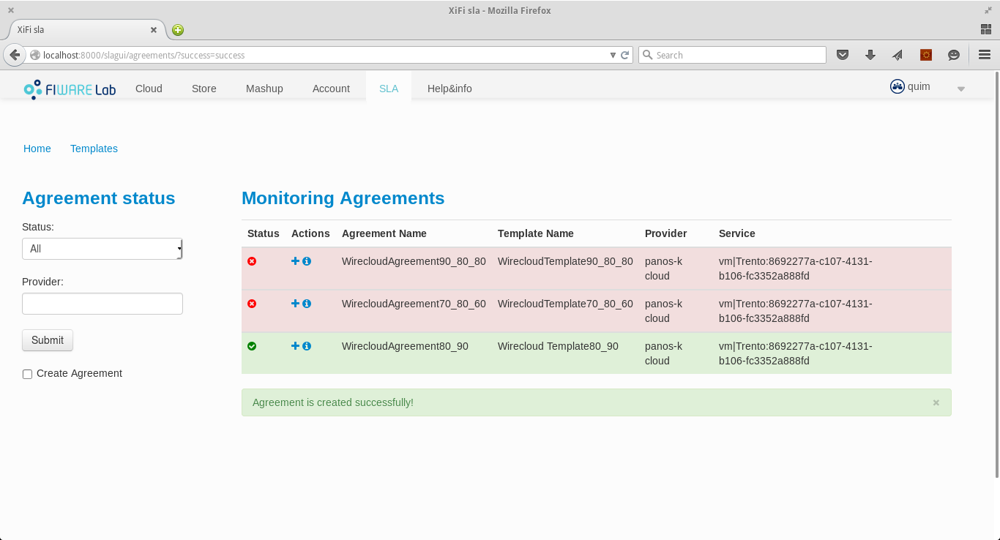
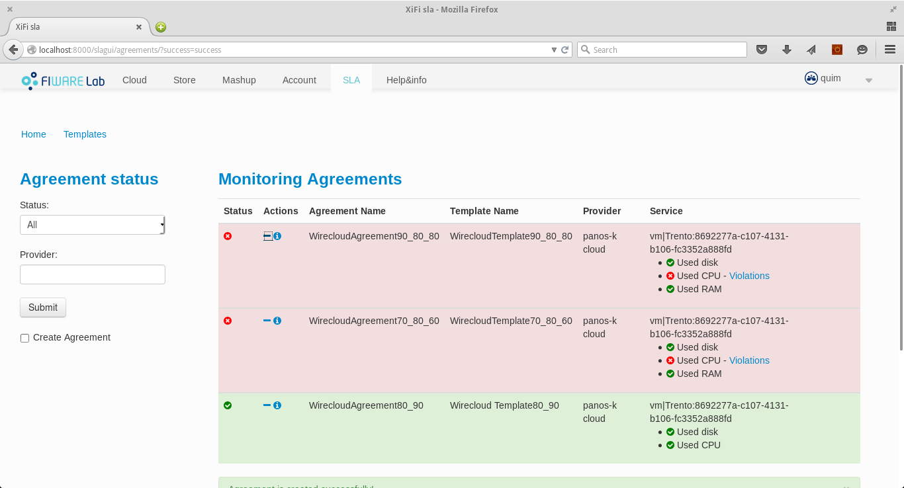
")
")
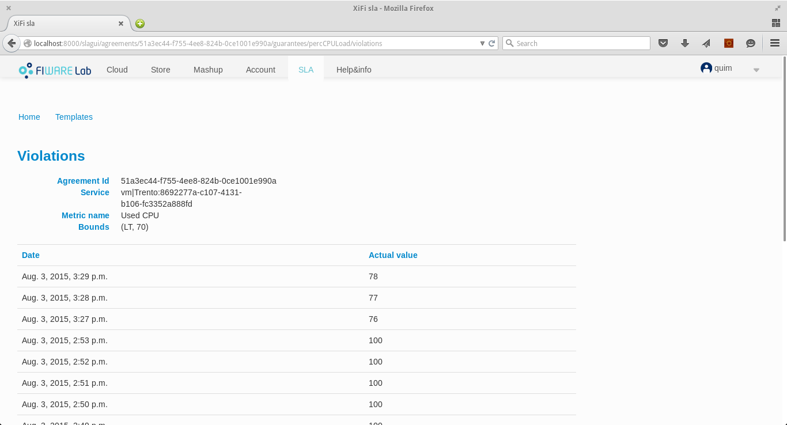

# Directory structure

The sla-dashboard application is composed by the following directories:
* sladashboard: the app related to the application itself. The settings
    file maybe need to be modified: read below.
* slagui: the sla dashboard GUI project.
* slaclient: this project contains all the code needed to connect to
    SLA Manager REST interface, and the conversion from xml/json to python
    objects.
* samples: this directory contains sample files to load in the SLA Manager for
    testing.
* bin: some useful scripts

# Software requirements

* Python version: 2.7.x
* The required python packages are listed in requirements.txt
* Installing the requirements inside a virtualenv is recommended.
* [SLA Manager](https://github.com/Atos-FiwareOps/sla-framework)
(java backend) needs to be running in order to use the dashboard.

## Installing

### Install virtualenv

    pip install virtualenv

### Create virtualenv

    virtualenv $VIRTUALENVS_DIR/sla-dashboard

### Activate virtualenv

    . $VIRTUALENVS_DIR/sla-dashboard/bin/activate

or
 
    . $VIRTUALENVS_DIR/sla-dashboard/Scripts/activate

### Change to application dir and install requirements

    cd $SLA_DASHBOARD
    pip install -r requirements.txt

### Create needed tables for sessions, admin, etc

    ./manage.py syncdb

You must create the superUser in order to manage the users and providers:

    You just installed Django's auth system, which means you don't have any superusers defined.
    Would you like to create one now? (yes/no): yes
    Username (leave blank to use 'sla'): <<admin_sla>>
    Email address: xxx
    Password: xxx

### Settings

* sladashboard/settings.py:
    - SLA_MANAGER_URL : The URL of the SLA Manager REST interface.
    - DEBUG: Please, set this to FALSE in production

* sladashboard/urls.py:
    - dashboard root url: the slagui project is accessed by default
        in $server:$port/slagui. Change "slagui" with the desired path.

## Running in development mode

NOTE: this steps are not suitable in production mode.

### Activate virtualenv

    . $VIRTUALENVS_DIR/sla-dashboard/bin/activate

### Cd to application dir

    cd $SLA_DASHBOARD

### Start server listing in port 8000 (change port as desired)

    ./manage.py runserver 0.0.0.0:8000

### Test

    curl http://localhost:8000/slagui

## Configure the users and roles

The file initial_data.json has created automatically the groups CONSUMER AND PROVIDER when you have executed "./manage.py syncdb".

You only need to create the users and the providers associated to the agreements and to assig the correct role (CONSUME and PROVIDER).

In order to introduce them you have to connect to http://localhost:8000/admin and add the new users (with CONSUME or PROVIDER goups).
