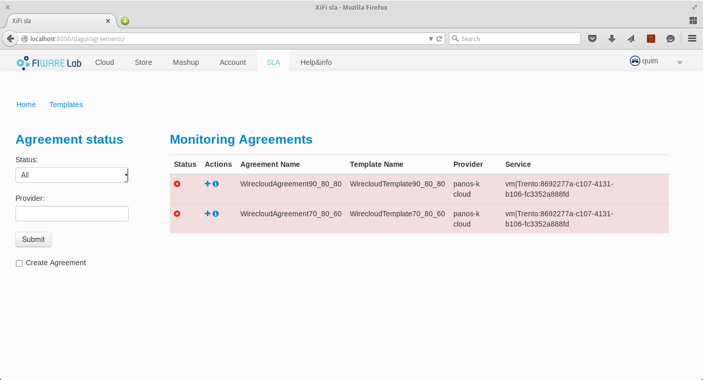

# SLA Dashboard

* [Introduction](#introduction)
* [Directory Structure](#directory-structure)
* [Installing](#installing)
	* [Software Requirements](#software-requirements)
	* [Installation steps](#installation-steps)
	* [Configuration](#configuration)
* [Running](#running)
	* [Running in development mode](#running-in-development-mode)
	* [Deploying in a production server](#deploying-in-a-production-server)
* [User guide](#user-guide)

## Introduction

The SLA Dashboard is a Django web application that in conjunction with the 
[Atos SLA Manager Core](https://github.com/Atos-FiwareOps/sla-framework)
and the Monitoring and Authentication Generic Enablers from
[FiWare](http://fiware.org/) provides a user interface to manage SLA components
and their lifecycle.

The SLA Dashboard allows to:

* Create SLA templates for exiting services in Fiware.
* Create SLA Agreements from defined templates.
* Check information about an existing SLA template.
* Check information about an existing SLA agreement.
* Visualize information about violations and breaches.

All these operations rely tightly on the user credentials and permissions inside
the Fiware's project. This information is retrieved from the Fiware's
identity manager.

## Directory structure

The sla-dashboard application is composed by the following directories:
* sladashboard: the app related to the application itself. The settings
    file maybe need to be modified: read below.
* slagui: the sla dashboard GUI project.
* slaclient: this project contains all the code needed to connect to
    SLA Manager REST interface, and the conversion from xml/json to python
    objects.
* samples: this directory contains sample files to load in the SLA Manager for
    testing.
* bin: some useful scripts

## Installing

### Software requirements

* Python 2.7.x
* Python Virtualenv (recommended).
* [SLA Manager](https://github.com/Atos-FiwareOps/sla-framework)
(java backend) needs to be running in order to use the dashboard.

### Installation steps

The SLA Dashboard is a Django-based web application. As a recommendation, any
Python application should run in it own Virtual Environment, so it can use the
needed versions of its dependecies without interfering with other applications'
dependencies.

You can find the dependency list in the file requirements.txt. This is a Python
standard file that defines the a list of packages that need to be installed that
is understandable by pip. It allows to install the whole bunch of needed
libraries all at once.

The list of steps to get the SLA installed are the following:

1. Install virtualenv

		$ pip install virtualenv

2. Create virtualenv

		$ virtualenv $VIRTUALENV_NAME

3. Activate virtualenv

		$ . $VIRTUALENV_NAME/bin/activate

4. Change to application dir and install requirements

		($VIRTUALENV_NAME)$ cd $SLA_DASHBOARD_DIR
		($VIRTUALENV_NAME)$ pip install -r requirements.txt

5. Create needed tables for sessions, admin, etc

		($VIRTUALENV_NAME)$ python manage.py syncdb

6. You must create the a super user in order to manage the users and providers:

		($VIRTUALENV_NAME)$ python manage.py createsuperuser
		Username (leave blank to use 'user'): {admin_username}
		Email address: {admin_email_address}
		Password: {admin_password}
		Password (again): {admin_password}
		Superuser created successfully.

### Configuration

The SLA Dashboard application needs a minimal configuration. Basically, the only
parameters to be set are the URL where the SLA Manager Core instance that is
going to be used can be found and the parameter that enables the debug mode.

These parameters can be found in the file sladashboard/settings.py as:

* SLA_MANAGER_URL: The URL of the SLA Manager REST interface.
* DEBUG: Please, set this to FALSE in production

## Running

The Django framework provides its own and lightweight development server. It
allows to quickly deploy the web application, withouth dealing with production
server configurations and use it for testing purposes. It also provides
automatic redeploying of the application when changes are performed, as well as
debugging capabilities in conjuntion with other Python debugging tools.

When deploying the application in ptoduction mode several solutions exist.
Web servers like Apache or Nginx can be used in combination with other
application servers. In this document we propose an deployment environment using
Nginx, Gunicorn, Virtualenv and Supervisor on a Debian 8 machine.
Please, feel free to send us feedback about other possible configurations.

### Running in development mode

If you want to run and test quickly the SLA Dashboard application, the easiest
way is to use the embedded web server integrated in the Django framework. To do
so, after performing the previous installation and configuration instructions,
follos these steps:

1. Activate virtualenv

		$ . $VIRTUALENVS_NAME/sla-dashboard/bin/activate

2. Change to the application directory

		($VIRTUALENV_NAME)$ cd $SLA_DASHBOARD

3. Start server

		($VIRTUALENV_NAME)$ python manage.py runserver

	The default URL served by the server is 127.0.0.0:8000. In order you want to use
	a different url or port, you can indicate it in the command:

		($VIRTUALENV_NAME)$ python manage.py runserver 0.0.0.0:8001

	You can find more information about the development server in the [Django
	documentation webpage](https://docs.djangoproject.com/en/1.8/ref/django-admin/#runserver-port-or-address-port).

4. Test

		$ curl http://127.0.0.1:8000/slagui

### Deploying in production mode

As mentioned before, several deployment configurations are possible. In this
section we described how we deployed this in a production environment using
Debian 8, Nginx, Gunicorn, Supervisor and Virtualenv.

We supose that you have performed the installation steps and you have set up a
virtual environment for the project.

We also suppose those global variables:

* $SLA_DASHBOARD_DIR: the directory the SLA Dashboard code has been placed.
* $SLA_DASHBOARD_VENV_DIR: the directory where the dedicated virtual 
environment for the SLA Dashboard resides.

Most of the scripts have are based on [Michał Karzyński](https://gist.github.com/postrational)
Gist examples on [how to set up Django on Nginx with Gunicorn and supervisor](https://gist.github.com/postrational/5747293#file-gunicorn_start-bash).

The steps are the following:

1. Install the dependences

		$ sudo pip install virtualenv
		$ sudo aptitude install nginx gunicorn supervisor

2. Create a Gunicorn start script

	This script can be placed wherever you want. In our case, we placed it in
	$SLA_DASHBOARD_DIR/bin/gunicorn_start.

		#!/bin/bash

		NAME="sladashboard"                           # Name of the application
		DJANGODIR=$SLA_DASHBOARD_DIR                  # Django project directory
		SOCKFILE=$SLA_DASHBOARD_DIR/gunicorn.sock     # we will communicate using this unix socket
		USER=root                                     # the user to run as
		GROUP=root                                    # the group to run as
		NUM_WORKERS=3                                 # how many worker processes should Gunicorn spawn
		DJANGO_SETTINGS_MODULE=sladashboard.settings  # which settings file should Django use
		DJANGO_WSGI_MODULE=sladashboard.wsgi          # WSGI module name
		
		echo "Starting $NAME as `whoami`"
		
		# Activate the virtual environment
		cd $DJANGODIR
		source $SLA_DASHBOARD_VENV_DIR/bin/activate
		export DJANGO_SETTINGS_MODULE=$DJANGO_SETTINGS_MODULE
		export PYTHONPATH=$DJANGODIR:$PYTHONPATH
		
		# Create the run directory if it doesn't exist
		RUNDIR=$(dirname $SOCKFILE)
		test -d $RUNDIR || mkdir -p $RUNDIR
		
		# Start your Django Unicorn
		# Programs meant to be run under supervisor should
		#   not daemonize themselves (do not use --daemon)
		exec $SLA_DASHBOARD_VENV_DIR/bin/gunicorn ${DJANGO_WSGI_MODULE}:application \

		  --name $NAME \
		  --workers $NUM_WORKERS \
		  --user=$USER --group=$GROUP \
		  --bind=unix:$SOCKFILE \
		  --log-level=debug \
		  --log-file=-

3. Create the Supervisor script to start/stop the application:

	It should be placed in /etc/supervisor/conf.d/sladashboard.conf and should
	contain the following parameters:

		[program:sladashboard]
		command = $SLA_DASHBOARD_DIR/bin/gunicorn_start                   ; Command to start app
		user = root                                                       ; User to run as
		stdout_logfile = $SLA_DASHBOARD_DIR/logs/gunicorn_supervisor.log  ; Where to write log messages
		redirect_stderr = true                                            ; Save stderr in the same log
		environment=LANG=en_US.UTF-8,LC_ALL=en_US.UTF-8 

4. Create Nginx virtual servers

	This script should be placed in /etc/nginx/sites-available/slagui

		upstream sladashboard_app_server {
		  # fail_timeout=0 means we always retry an upstream even if it failed
		  # to return a good HTTP response (in case the Unicorn master nukes a
		  # single worker for timing out).

		  server unix:$SLA_DASHBOARD_DIR/gunicorn.sock fail_timeout=0;
		}

		server {
			listen   0.0.0.0:80;
			server_name localhost {public_ip};

			client_max_body_size 4G;

			access_log $SLA_DASHBOARD_DIR/logs/nginx-access.log;
			error_log $SLA_DASHBOARD_DIR/logs/nginx-error.log;

			location /static {
				alias   $SLA_DASHBOARD_DIR/static/;
			}

			location /media/ {
				alias   $SLA_DASHBOARD_DIR/media/;
			}

			location / {
				# an HTTP header important enough to have its own Wikipedia entry:
				#   http://en.wikipedia.org/wiki/X-Forwarded-For
				proxy_set_header X-Forwarded-For $proxy_add_x_forwarded_for;

				# enable this if and only if you use HTTPS, this helps Rack
				# set the proper protocol for doing redirects:
				# proxy_set_header X-Forwarded-Proto https;

				# pass the Host: header from the client right along so redirects
				# can be set properly within the Rack application
				proxy_set_header Host $http_host;

				# we don't want nginx trying to do something clever with
				# redirects, we set the Host: header above already.
				proxy_redirect off;

				# set "proxy_buffering off" *only* for Rainbows! when doing
				# Comet/long-poll stuff.  It's also safe to set if you're
				# using only serving fast clients with Unicorn + nginx.
				# Otherwise you _want_ nginx to buffer responses to slow
				# clients, really.
				# proxy_buffering off;

				# Try to serve static files from nginx, no point in making an
				# *application* server like Unicorn/Rainbows! serve static files.
				if (!-f $request_filename) {
					proxy_pass http://sladashboard_app_server;
					break;
				}
			}

			# Error pages
			error_page 500 502 503 504 /500.html;
			location = /500.html {
				root $SLA_DASHBOARD_DIR/static/;
			}
		}

5. Create a common directory for static files of all the Django applications in
the SLA Dashboard, to be easily served in production:

		$ cd $SLA_DASHBOARD_DIR
		$ . $VIRTUALENV_NAME/bin/activate
		($VIRTUALENV_NAME)$ python manage.py collectstatic

6. Start/restart the app using supervisor:

		$ sudo supervisorctl restart sladashboard

7. Add the virtual server for the SLA Dashboard application to the directory of
enabled sites and restart Nginx:

		$ sudo ln -s /etc/nginx/sites-available/slagui /etc/nginx/sites-enabled
		$ sudo systemctl restart nginx.service 

8. Test it

	curl http://localhost/slagui

## Configure the users and roles

The file initial_data.json has created automatically the groups CONSUMER AND
PROVIDER when you have executed "python manage.py syncdb".

You only need to create the users and the providers associated to the agreements
and to assig the correct role (CONSUME and PROVIDER).

In order to introduce them you have to connect to http://localhost:8000/admin
and add the new users (with CONSUME or PROVIDER goups).

# User guide

")
")

